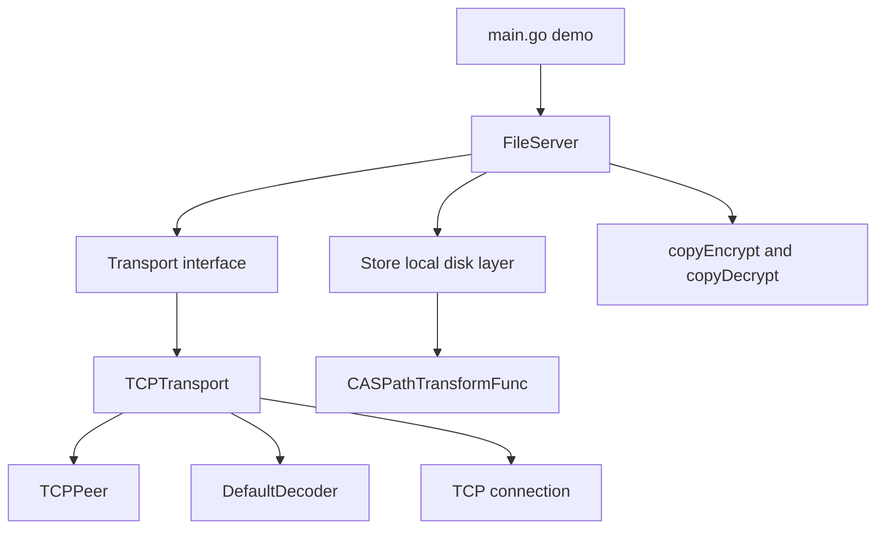
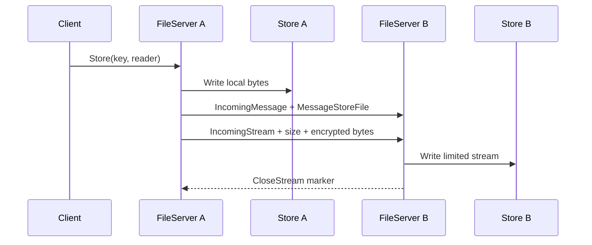
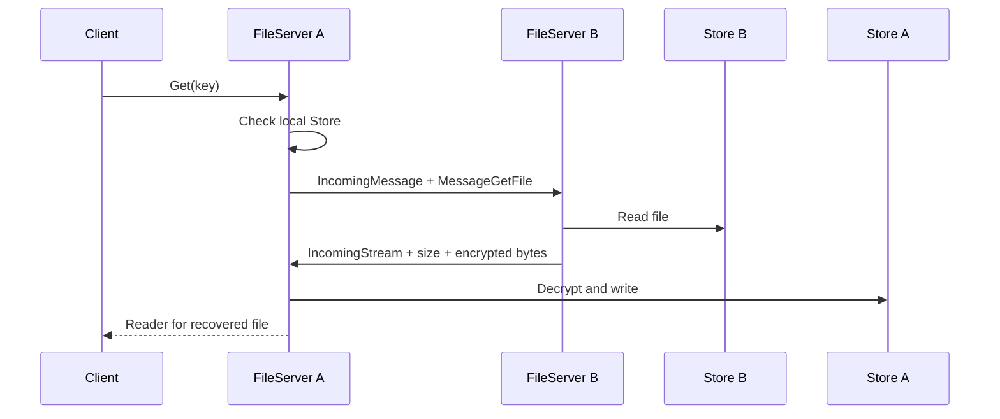

# System Architecture

## Layered View



## Components

### 1. Application and orchestration

`main.go` creates several nodes, starts them, stores sample data, removes a local copy, and fetches it from a peer. It is a demonstration program rather than a reusable CLI.

`server.go` owns the distributed file behavior. It knows when to use local disk, when to broadcast a request, and how to route a remote store or get message.

### 2. Storage

`store.go` maps `(node ID, key)` to a path under the configured root:

```text
root / node-id / transformed-path / transformed-filename
```

`CASPathTransformFunc` hashes the logical key with SHA-1, splits the hexadecimal hash into five-character directories, and uses the full hash as the filename. This avoids putting many files in one directory.

The storage layer exposes:

- `Has`: check whether a transformed file exists.
- `Write`: copy bytes from an `io.Reader` to disk.
- `Read`: return the file size and an open reader.
- `Delete`: remove the first transformed directory for a key.
- `Clear`: remove the configured storage root.

### 3. Transport

`p2p/transport.go` defines the contracts. A `Peer` is a connection that can read and write bytes, send a payload, and signal the end of a stream. A `Transport` can listen, dial, expose its address, consume decoded RPCs, and close.

`p2p/tcp_transport.go` implements those contracts:

1. `ListenAndAccept` opens a TCP listener.
2. The accept loop creates a `TCPPeer` for each connection.
3. The handshake runs.
4. The peer is registered with `FileServer.OnPeer`.
5. The decoder reads RPCs until the connection closes.
6. Stream markers pause the RPC read loop until the file stream is consumed.

### 4. Wire protocol

The current protocol uses one-byte markers:

```text
0x01 IncomingMessage
0x02 IncomingStream
```

A normal message is expected to be:

```text
[0x01][gob-encoded Message]
```

A file stream is expected to be:

```text
[0x02][int64 file size, little endian][encrypted file bytes]
```

The application message types are:

- `MessageStoreFile`: sender ID, key, and encrypted stream size.
- `MessageGetFile`: sender ID and key requested from peers.

### 5. Encryption

`crypto.go` uses AES-256 in CTR mode. `copyEncrypt` generates a random 16-byte IV and writes it before encrypted bytes. `copyDecrypt` reads the IV and reconstructs the stream cipher.

The `+16` size adjustment in `FileServer.Store` accounts for the IV prepended to the encrypted stream.

## Store Flow



## Get Flow



## Failure and Lifecycle Notes

- A listener error caused by a deliberate close ends the accept loop.
- Other accept errors are logged and retried.
- A peer connection is closed when handshake, registration, decoding, or streaming fails.
- `FileServer.Stop` closes the quit channel; the loop then closes the transport.
- The demo uses fixed sleeps to wait for startup and fetch completion. This is convenient for a demo but should become readiness signals and request correlation in a real system.
